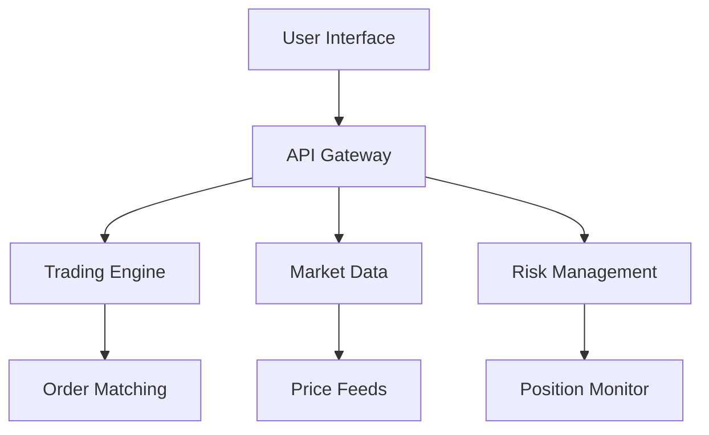

## Core Features

### Prediction Protocol Infrastructure

HYPIQ leverages Hyperliquid's high-performance infrastructure to deliver:

- **Real-time Position Monitoring**: Track large positions and their PNL in real-time
- **CLOB-based Prediction Markets**: Central limit order book for transparent price discovery
- **On-chain Settlement**: All outcomes verified and settled transparently on-chain
- **High-speed Execution**: Sub-second prediction placement and resolution

### Prediction Market Features

<CardGroup cols={2}>
  <Card title="Real-time Position Tracking" icon="activity">
    Monitor large Hyperliquid positions and their real-time PNL status
  </Card>
  <Card title="Outcome Prediction" icon="bullseye">
    Predict whether positions will close in profit (PNL+) or loss (PNL−)
  </Card>
  <Card title="Transparent Settlement" icon="shield-check">
    All outcomes settled on-chain with verifiable position data
  </Card>
  <Card title="Liquidity Pools" icon="layers">
    Deep liquidity for prediction markets powered by CLOB infrastructure
  </Card>
</CardGroup>

## Prediction Mechanics

### How Predictions Work

HYPIQ's prediction system operates on transparent, verifiable data:

- **Position Selection**: Large positions on Hyperliquid are automatically identified
- **Prediction Window**: Users predict PNL outcomes before position closure
- **Market Creation**: CLOB-based markets for each prediction with live odds
- **Settlement**: Outcomes verified using actual Hyperliquid position data

### Risk Management

<Accordion title="Position Sizing">
  Automated position sizing based on risk parameters and account balance
</Accordion>

<Accordion title="Stop Loss">
  Automatic stop loss orders to limit potential losses
</Accordion>

<Accordion title="Take Profit">
  Automatic profit-taking at predetermined levels
</Accordion>

## Platform Architecture

The HYPIQ platform is built on modern, scalable architecture:

## Security Features

<Warning>
  Security is our top priority. All user funds and data are protected with industry-leading security measures.
</Warning>

- **Multi-signature Wallets**: Enhanced security for fund storage
- **Two-Factor Authentication**: Additional account protection
- **Encrypted Communications**: All data transmission is encrypted
- **Regular Security Audits**: Continuous security monitoring and updates

## Getting Support

Need help with the platform? We're here to assist:

<CardGroup cols={2}>
  <Card title="Documentation" icon="book" href="/faq">
    Browse our comprehensive FAQ section
  </Card>
  <Card title="Contact Support" icon="envelope" href="mailto:support@hypiq.finance">
    Reach out to our support team directly
  </Card>
</CardGroup>